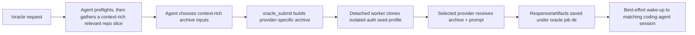

# pi-oracle

`pi-oracle` lets a `pi` or Prime Agent session send hard, long-running work to ChatGPT.com or Grok through the web app, with repo archives, background execution, saved results, and a best-effort wake-up back into the originating coding-agent session when the answer is ready.

> Status: experimental public beta. Current host baselines are pi `0.80.9` and Prime Agent `0.7.2`. The existing platform-smoke matrix covers pi on macOS, Linux, and Windows native with Chromium-family browsers; Prime Agent compatibility has a separate package/type/host-behavior gate and should not be read as the same cross-platform matrix. Pi-bundled runtime packages remain optional wildcard peers so npm peer ranges do not block newer host releases. Normal oracle jobs run in an isolated browser profile, not your active browser window.

## What a successful run looks like

```text
You: /oracle Review the pending changes. Include the whole repo unless a narrower archive is clearly better.

pi-oracle:
  1. preflights local session/auth readiness
  2. builds a context-rich provider archive (`.tar.zst` for ChatGPT, `.tar.gz` for Grok)
  3. starts an isolated provider web runtime in the background
  4. uploads the archive and prompt to the selected provider
  5. saves the response/artifacts under /tmp/oracle-<job-id>/
  6. sends a best-effort wake-up back to the matching coding-agent session

Later: /oracle-read <job-id>
```

What you are seeing: the local `pi` or Prime Agent host keeps control of context selection and safety checks, while the selected web provider handles the expensive second-opinion work asynchronously. If the wake-up is missed, the result still lives on disk and can be read by job id.

## Who this is for

Use `pi-oracle` if you use `pi` or Prime Agent and want a larger asynchronous reviewer, planner, or analyst that can use your real ChatGPT or Grok web account instead of an API model.

It is most useful for:

- maintainers reviewing broad repo changes before shipping
- agents that need a slower second opinion without blocking the main coding-agent turn
- migration, architecture, or failure-mode analysis that benefits from a large archive
- follow-up questions that should continue the same provider thread later

Do not use it for:

- short local coding tasks that the active coding agent can handle directly
- projects that must never be uploaded to ChatGPT.com, Grok, or another configured web provider
- machines outside the currently supported local browser/tooling setup

## Problem it solves

A normal coding-agent turn is the wrong shape for some work: the task may need a large repo snapshot, a slower web model, a real ChatGPT/Grok subscription, artifact downloads, or a durable result that arrives after the active turn ends.

`pi-oracle` makes that workflow explicit and recoverable instead of asking the main agent to manually drive provider chat UIs in your real browser window.

## What it does

| Problem | Capability | Proof in this repo |
| --- | --- | --- |
| Hard tasks need more context than a quick turn should gather. | `/oracle` prompts the agent to preflight, choose a context-rich archive, and submit it to the selected provider web app. | [`prompts/oracle.md`](prompts/oracle.md), `oracle_submit`, archive tests in `scripts/oracle-sanity-*` |
| Browser automation should not steal focus or mutate your active profile. | Jobs clone an authenticated seed profile into per-job isolated runtime profiles. | [`docs/ORACLE_DESIGN.md`](docs/ORACLE_DESIGN.md), [`extensions/oracle/lib/runtime.ts`](extensions/oracle/lib/runtime.ts) |
| Long jobs need durability. | Job state, responses, logs, and artifacts persist under `${PI_ORACLE_JOBS_DIR:-/tmp}/oracle-<job-id>/`. | [`extensions/oracle/lib/jobs.ts`](extensions/oracle/lib/jobs.ts), `/oracle-read`, `/oracle-status` |
| Provider auth can expire or drift. | `/oracle-auth [chatgpt|grok]` refreshes the isolated auth seed from a configured local Chromium profile, with recovery guidance. | [`extensions/oracle/lib/auth.ts`](extensions/oracle/lib/auth.ts), [`docs/ORACLE_RECOVERY_DRILL.md`](docs/ORACLE_RECOVERY_DRILL.md) |
| Agents need a simple API, not UI-driving instructions. | The package exposes agent-facing tools: `oracle_preflight`, `oracle_submit`, `oracle_read`, `oracle_auth`, and `oracle_cancel`. | [`extensions/oracle/lib/tools.ts`](extensions/oracle/lib/tools.ts) |

## Fastest way to see it work

### 1. Install

#### pi

From npm:

```bash
pi install npm:pi-oracle
```

Or from GitHub:

```bash
pi install https://github.com/fitchmultz/pi-oracle
```

Update with `pi update --extensions`, `pi update --all`, or `pi update npm:pi-oracle`. Bare `pi update` updates pi itself only.

#### Prime Agent

Install the GitHub package:

```bash
prime-agent package install git:github.com/fitchmultz/pi-oracle
```

Or try it for one run without changing package settings:

```bash
prime-agent -e git:github.com/fitchmultz/pi-oracle
```

After the Prime-capable release is published to npm, `npm:pi-oracle` can be used with `prime-agent package install`, `prime-agent -e`, and `prime-agent package update`. See the [Prime Agent integration guide](docs/PRIME_AGENT.md) for host-specific configuration and development-branch testing.

Versioned npm/git refs stay pinned until you change the configured source.

### 2. Check requirements

You need:

- macOS, Linux, or Windows native
- Node.js 22.19.0 or newer for package install/use; platform smoke/release validation currently expects Node 24+ per `platform-smoke.config.mjs`
- Tested host baselines: pi 0.80.9 and Prime Agent 0.7.2; other versions are not blocked by package metadata but are outside the recorded compatibility baseline
- Google Chrome/Chromium or another Chromium-family browser
- ChatGPT or Grok already signed in to the configured local browser profile for the provider you plan to use
- `agent-browser` and `tar` available on the machine; `zstd` is also required when submitting ChatGPT `.tar.zst` archives
- on macOS APFS clone mode, `cp` available on PATH or via `PI_ORACLE_CP_PATH`; Linux/Windows runtime profile copies use Node's recursive copy
- a normal persisted coding-agent session; do not start `pi` or `prime-agent` with `--no-session`
- on Linux, encrypted Chromium cookies may also require `secret-tool` (GNOME/libsecret) or `kwallet-query` + `dbus-send` (KDE), unless a Chrome/Brave safe-storage password override is set for the auth run

### 3. Sync provider auth once

```text
/oracle-auth
```

This reads cookies for the configured default provider from your local browser profile and writes an isolated oracle seed profile. Use `/oracle-auth grok` to force-refresh the Grok seed when your default provider is still ChatGPT. It should not automate your active browser window for normal jobs.

### 4. Submit a tiny job

```text
/oracle Read README.md and package.json. Tell me in five bullets what this package does and who should not use it.
```

Expected result:

- The `/oracle` prompt now runs an early oracle preflight before expensive repo reading or archive creation.
- The agent chooses a context-rich relevant archive up to the selected provider's upload ceiling, not the smallest possible one-file slice when nearby context helps.
- `oracle_submit` creates or queues a job.
- If local packing is too large, the prompt treats that as a retryable archive-selection failure and narrows automatically before surfacing the problem.
- The job uploads a repo archive to the selected provider, capped at 250 MiB for ChatGPT or 200 MiB for Grok after default exclusions/pruning.
- The response is saved under `/tmp/oracle-<job-id>/response.md` by default.
- The matching `pi` or Prime Agent session gets one best-effort wake-up when the job finishes.

If the wake-up does not arrive, run:

```text
/oracle-status
/oracle-read <job-id>
```

## Example requests

```text
/oracle Review the current pending changes. Include the whole repo unless a narrower archive is clearly better. Give me a prioritized code review with concrete fixes.
```

```text
/oracle Read the codebase and explain the highest-risk auth/session failure modes, including what to test before shipping.
```

```text
/oracle Explain the README guidance for /oracle-clean retention grace. Archive README.md plus any nearby docs or implementation files that help answer accurately.
```

```text
/oracle-followup <job-id> Tighten the migration plan around rollback risk, and include the most relevant surrounding files/docs as long as the archive stays comfortably within the 250 MiB limit.
```

```text
/oracle Continue existing ChatGPT conversation 6a28ab5c-e4d4-83e8-b8be-dd39f38a26d6. Review the current auth code and include enough surrounding context to propose concrete fixes.
```

## How it works



Key design choices:

- **Extension-managed dispatch owns context gathering.** In the TUI, `/oracle` and `/oracle-followup` are intercepted before prompt-template expansion, re-added as compact user messages for prompt-history/up-arrow recall, and paired with detailed dispatch instructions as hidden context. The visible transcript stays compact while the agent still preflights, gathers context, chooses archive inputs, and stops after dispatch.
- **Tools own execution.** `oracle_submit` builds the archive, admits or queues the job, starts the worker, and returns immediately.
- **Auth uses a seed profile.** `/oracle-auth` imports cookies into an isolated seed profile; each job clones that seed into its own temporary runtime profile.
- **Follow-ups preserve provider thread state.** `/oracle-followup <job-id> ...` resolves the prior job's saved provider URL and submits the next prompt with `followUpJobId`.
- **Existing ChatGPT browser threads are opt-in.** Normal `/oracle` jobs still start a fresh provider thread. When the user explicitly provides a ChatGPT conversation id or `https://chatgpt.com/c/...` URL, the agent passes `chatGptConversationId` so `oracle_submit` opens that existing thread in the isolated runtime.
- **Wake-up is best effort, storage is durable.** A missed wake-up does not lose the result.

## Commands and tools

User-facing commands:

- `/oracle <request>` — prepare context and dispatch a ChatGPT or Grok web oracle job. If the request explicitly includes an existing ChatGPT conversation id/URL, the agent can continue that browser-created thread; otherwise `/oracle` starts a fresh thread as before.
- `/oracle-followup <job-id> <request>` — continue an earlier oracle job in the same provider thread
- `/oracle-auth [chatgpt|grok]` — sync provider cookies into the isolated oracle auth seed profile
- `/oracle-read [job-id]` — inspect job status and saved response preview
- `/oracle-status [job-id]` — inspect a job or list recent job ids when no explicit id is given
- `/oracle-cancel <job-id>` — cancel a queued or active job
- `/oracle-clean <job-id|all>` — remove temp files for terminal jobs; recently woken terminal jobs may stay retained briefly, and a blocked cleanup returns the next eligible cleanup time

Agent-facing tools:

- `oracle_preflight`
- `oracle_auth`
- `oracle_submit` (`chatGptConversationId` is optional and only for explicitly continuing an existing ChatGPT browser conversation id/URL; omit it for the default fresh thread)
- `oracle_read`
- `oracle_cancel`

## Configuration

Most users can start with defaults. Set an agent-level config only when you need a non-default provider, mode, preset, or browser profile.

| Host | Agent-level config | Project-safe overrides |
| --- | --- | --- |
| pi | `~/.pi/agent/extensions/oracle.json` | `.pi/extensions/oracle.json` |
| Prime Agent | `~/.prime/agent/extensions/oracle.json` | `.prime/agent/extensions/oracle.json` |

Browser paths, cookie sources, and other privileged `auth.*` settings are accepted only from the agent-level config for both hosts. Project files are restricted to safe Oracle overrides.

Pi 0.79+ gates project-local inputs behind project trust. `pi-oracle` preserves its historical behavior for existing users: `.pi/extensions/oracle.json` loads by default and is ignored when you explicitly opt out with `--no-approve` or save a “do not trust” decision. Prime Agent treats explicitly loaded repository resources as trusted code; Oracle still filters `.prime/agent/extensions/oracle.json` to the same safe project keys.

Example agent-level config for the active host:

```json
{
  "defaults": {
    "provider": "chatgpt",
    "preset": "<preset id from ORACLE_SUBMIT_PRESETS>",
    "grokMode": "heavy"
  },
  "auth": {
    "chromeProfile": "Default"
  }
}
```

Notes:

- `defaults.provider` is the default web provider: `chatgpt` or `grok`.
- `defaults.preset` is the default ChatGPT model preset for oracle jobs.
- `defaults.grokMode` is the default Grok mode. Only `heavy` is supported today.
- The canonical preset ids and provider modes live in [`extensions/oracle/lib/config.ts`](extensions/oracle/lib/config.ts).
- If the packaged default is fine, omit `defaults`.
- When an agent is unsure which oracle preset fits, it should omit `preset` and use the configured default model instead of asking by default. If the prompt says to use Grok, it should pass `provider: "grok"` to `oracle_submit`.
- You usually do not need browser paths unless auto-detection fails.

### Linux cookie import notes

`/oracle-auth` delegates the default cookie read to `@steipete/sweet-cookie`'s Linux Chrome/Chromium backend. The packaged default auto-detects existing Google Chrome, Chromium, Chromium Browser, or Brave profile roots under `${XDG_CONFIG_HOME:-~/.config}` and passes non-Google roots as absolute profile paths so the correct cookie DB is read. Set `auth.chromeProfile` to another profile name, a profile directory, or a `Cookies` DB path when needed, and leave `auth.chromiumKeychain` unset on Linux.

Sweet Cookie's Linux encrypted-cookie handling is controlled outside pi-oracle:

- `SWEET_COOKIE_LINUX_KEYRING=gnome|kwallet|basic` selects GNOME/libsecret, KDE KWallet, or no keyring probing.
- GNOME probing shells out to `secret-tool`; KDE probing shells out to `kwallet-query` and `dbus-send`.
- `SWEET_COOKIE_CHROME_SAFE_STORAGE_PASSWORD` and `SWEET_COOKIE_BRAVE_SAFE_STORAGE_PASSWORD` bypass keyring probing when you already know the browser safe-storage password.

Do not put safe-storage passwords in project config or persistent shell startup files. Prefer keyring helpers when possible; if you use an environment override for one `/oracle-auth` run, pi-oracle scrubs it before launching browser/helper subprocesses after cookie import.

### Custom Chromium cookie sources

Most Chrome/Chromium-compatible browsers should work through Sweet Cookie's default Chrome backend when `auth.chromeProfile` points at the right profile or cookie DB. pi-oracle does not currently select Sweet Cookie's Edge or Firefox backends. The `auth.chromiumKeychain` alternate path is macOS-only and is intended for a Chromium-family browser that is not one of Sweet Cookie's built-in Chrome/Brave/Arc/Chromium targets or otherwise cannot import cookies without dependency patching.

Before running `/oracle-auth` with this macOS path:

1. Log into ChatGPT or Grok in the target browser profile, depending on `defaults.provider`.
2. Fully quit the browser so its `Cookies` database is stable.
3. Find the profile `Cookies` SQLite DB path.
4. Find the browser's macOS Keychain safe-storage item account and service name.
5. Configure all of `browser.executablePath`, `auth.chromeCookiePath`, and `auth.chromiumKeychain` in the agent-level Oracle config for your host (`~/.pi/agent/extensions/oracle.json` or `~/.prime/agent/extensions/oracle.json`).

Example macOS Helium config:

```json
{
  "browser": {
    "executablePath": "/Applications/Helium.app/Contents/MacOS/Helium"
  },
  "auth": {
    "chromeProfile": "Default",
    "chromeCookiePath": "/Users/you/Library/Application Support/net.imput.helium/Default/Cookies",
    "chromiumKeychain": {
      "account": "Helium",
      "services": ["Helium Storage Key"],
      "label": "Helium Storage Key"
    }
  }
}
```

`auth.chromeCookiePath` remains the cookie database path for backward compatibility. On macOS, `auth.chromiumKeychain` must be paired with `auth.chromeCookiePath`; partial config is rejected so oracle does not silently fall back to a different browser source. When both are present on macOS, `/oracle-auth` uses pi-oracle's repo-owned generic Chromium cookie reader instead of patching `@steipete/sweet-cookie` internals. On Linux, `auth.chromiumKeychain` is rejected; use Sweet Cookie's Linux keyring/password environment options instead.

If macOS prompts for Keychain access during `/oracle-auth`, allow access for the configured browser safe-storage item. If auth still fails after cookies are synced, the cookie DB may be stale, from the wrong profile, or for an account that is logged out; reopen the configured browser profile, confirm ChatGPT works there, quit the browser, and rerun `/oracle-auth`. On Linux, inspect `/oracle-auth` diagnostics for Sweet Cookie warnings about `secret-tool`, `kwallet-query`, or safe-storage password overrides.

## Available providers and presets

| Provider | Mode / preset | Archive format | Upload ceiling |
| --- | --- | --- | --- |
| ChatGPT | Presets below | `.tar.zst` | 250 MiB |
| Grok | `heavy` only | `.tar.gz` | 200 MiB |

Grok uploads now use `.tar.gz` archives. Grok may accept `.tar.zst` uploads, but its execution environment can lack `zstd` tooling to extract them; gzip-compressed tar keeps extraction on standard tools. Manual testing against `https://grok.com` found a 200 MiB upload is accepted and a 200 MiB + 1 byte upload is rejected, so pi-oracle caps Grok archives at 200 MiB.

## Available ChatGPT presets

| Preset id | Description |
| --- | --- |
| `pro_standard` | Pro - Standard |
| `pro_extended` | Pro - Extended |
| `thinking_light` | Thinking - Light |
| `thinking_standard` | Thinking - Standard |
| `thinking_extended` | Thinking - Extended |
| `thinking_heavy` | Thinking - Heavy |
| `instant` | Instant |
| `instant_auto_switch` | Instant - Auto-switch to Thinking Enabled |

For ChatGPT, `oracle_submit` accepts canonical preset ids or a matching human-readable preset label. Keep config values on canonical ids. For Grok, use `provider: "grok"`; only Heavy is supported today.

## Outputs and cleanup

- Jobs persist response text, metadata, logs, and artifacts under `${PI_ORACLE_JOBS_DIR:-/tmp}/oracle-<job-id>/` by default.
- Jobs can queue automatically when runtime capacity is full.
- Completion delivery into `pi` is one-time best-effort wake-up based.
- `/oracle-read [job-id]` and `oracle_read({ jobId })` inspect saved output later.
- `/oracle-clean` removes terminal job temp files, but can briefly refuse cleanup after a wake-up so the follow-up turn can still read the saved paths.

## Privacy and local data

This extension is local-first, but it handles sensitive local and project data:

- `/oracle-auth` reads provider cookies from the configured local browser profile. Use `/oracle-auth grok` for Grok when ChatGPT remains the default provider.
- `oracle_submit` uploads selected project archives to the selected provider web app.
- Responses, logs, and artifacts are written to the configured oracle jobs directory.

Review the code and design docs before using it with private or regulated material.

## Current limits

- Experimental public beta, validated on macOS, Linux, and Windows native with Chromium-family browsers.
- Provider UI, auth, model controls, and artifact download behavior can drift.
- Archive uploads are capped at 250 MiB for ChatGPT and 200 MiB for Grok after default exclusions and automatic whole-repo pruning.
- A real ChatGPT or Grok web session is required for the provider you use.
- The README currently uses command-level proof and design docs; no public screenshot or demo GIF is checked into the repo.
- Production hardening should keep focusing on UI drift detection, auth recovery, artifact capture, platform compatibility, and environment diagnostics.

## Troubleshooting

### `/oracle-auth` fails or says login is required

- Make sure the selected provider works in the same local browser profile you configured.
- For custom Chromium cookie sources, confirm `auth.chromeCookiePath` points at that profile's `Cookies` DB. On macOS, also confirm `auth.chromiumKeychain.services` names the browser's safe-storage Keychain service. On Linux, leave `auth.chromiumKeychain` unset and use Sweet Cookie's `SWEET_COOKIE_LINUX_KEYRING`, `SWEET_COOKIE_CHROME_SAFE_STORAGE_PASSWORD`, or `SWEET_COOKIE_BRAVE_SAFE_STORAGE_PASSWORD` options for encrypted Chrome/Chromium/Brave cookies.
- Re-run `/oracle-auth`.
- Agent callers can use `oracle_auth({})` once before retrying a stale-auth oracle submission.
- If the provider is half-logged-in or challenge flow state looks weird, finish the login/challenge in the headed auth browser and retry.

### Custom Chromium auth says cookies synced but the session is rejected

This usually means the cookie import worked but the source cookies are not the active provider session you expected.

1. Open the configured browser profile.
2. Confirm the selected provider works there without logging in again.
3. Quit the browser fully so its `Cookies` DB is stable.
4. Confirm `auth.chromeCookiePath` points at that exact profile's `Cookies` DB.
5. On macOS, confirm `auth.chromiumKeychain.services` names the browser's safe-storage Keychain service for that DB. On Linux, confirm the relevant Sweet Cookie keyring helper or Chrome/Brave safe-storage password override is available.
6. Re-run `/oracle-auth`.

### You hit a challenge or verification page

- Solve it in the auth/bootstrap browser if prompted.
- Re-run `/oracle-auth` before submitting jobs again.

### You see “Oracle requires a persisted pi session” or “Oracle requires a persisted Prime Agent session”

- Do not run oracle from `pi --no-session`.
- Start a normal persisted `pi` or Prime Agent session, then use `/oracle` again.

### A job finished but no wake-up arrived

- Use `/oracle-read [job-id]` to inspect the saved response preview.
- Use `/oracle-status` if you need help finding a recent job id.
- Agent callers can use `oracle_read({ jobId })`.
- Results are still saved on disk even if the reminder turn does not land.

### `/oracle-clean` refuses a terminal job right after completion

- This can happen during the short post-send retention grace window after a wake-up was sent.
- The command returns a `Retry after ...` timestamp when that guard is active.
- Wait until that time, then rerun `/oracle-clean <job-id|all>`.

### A local dependency like `agent-browser`, `tar`, or `zstd` is missing

Install the missing local dependency and rerun the command. `zstd` is only needed for ChatGPT `.tar.zst` archive submissions; Grok submissions use `.tar.gz`. On macOS APFS clone mode, `cp` must also be available on PATH or configured with `PI_ORACLE_CP_PATH`; Linux and Windows profile copies use Node's recursive copy.

### Auto-detection picked the wrong browser profile

- Set `auth.chromeProfile` in the agent-level Oracle config for your host.
- For custom Chromium cookie sources, set `auth.chromeCookiePath` to the exact profile `Cookies` DB. Pair it with `auth.chromiumKeychain` only on macOS; on Linux, rely on Sweet Cookie's keyring/password environment options.
- Re-run `/oracle-auth`.

### You want more details about a failed run

Inspect the job directory under `${PI_ORACLE_JOBS_DIR:-/tmp}/oracle-<job-id>/`. The worker log and captured diagnostics are stored there.

## Verification

Useful local checks:

```bash
npm run check:oracle-extension
npm run check:prime-agent
npm run check:prime-agent:installed
npm run check:platform-smoke
npm run typecheck
npm run typecheck:worker-helpers
npm run sanity:oracle
npm run pack:check
npm test
npm run verify:oracle
```

`npm publish` is guarded by `prepublishOnly`, which runs `npm run release:check`. That release gate now blocks unless fresh live ChatGPT preset proof exists for every canonical preset, then requires doctor-first macOS, Ubuntu, and Windows native Crabbox evidence. The required Crabbox runtime suite uses packed-install proof, not source-tree `pi -e` loading.

Use the narrowest validation workflow that proves the change:

| Situation | Command(s) |
| --- | --- |
| Everyday local iteration | `npm run verify:oracle` |
| Prime Agent self-contained host/type behavior | `npm run check:prime-agent` |
| Installed Prime Agent shipped declarations | `npm run check:prime-agent:installed` (expects 0.7.2 by default) |
| Platform-focused syntax/invariant sanity | `npm run check:platform-smoke`, `npm run sanity:oracle:platform` |
| Platform-sensitive runtime changes | `npm run smoke:platform:doctor`, then a focused `node scripts/platform-smoke.mjs run --target <target> --suite <suite>` |
| Platform matrix proof | `npm run smoke:platform:all` |
| ChatGPT preset release proof | `npm run release:proof:chatgpt-presets` |
| Publish/release gate | `npm run release:check` |

`check:prime-agent:installed` locates the `prime-agent` executable on `PATH` and compiles the full extension against the declarations shipped by that exact installation. Set `PRIME_AGENT_PACKAGE_ROOT` for a non-PATH install or `PI_ORACLE_PRIME_AGENT_VERSION` when deliberately validating a newer baseline.

For macOS, Ubuntu, and Windows native package/build plus packed runtime validation, use [`docs/platform-smoke.md`](docs/platform-smoke.md). The full release gate is:

```bash
npm run release:check
```

Before a release, run live jobs through the loaded extension for every ChatGPT preset in `ORACLE_SUBMIT_PRESETS`. Each prompt must make the saved response contain exact markers `PRESET <preset> OK` and `PACKAGE pi-oracle`. After every job has completed, save the job ids/job directories in `.artifacts/chatgpt-preset-proof/latest.json`; `validatedAt` must be later than the completed jobs. Start from the checked, intentionally non-valid template:

```bash
mkdir -p .artifacts/chatgpt-preset-proof
node scripts/oracle-chatgpt-preset-proof.mjs template > .artifacts/chatgpt-preset-proof/latest.json
npm run release:proof:chatgpt-presets
```

The proof checker is intentionally part of `release:check`; it fails if the proof is missing, stale, tied to a different package version/git head, references jobs that completed before the current commit, or lacks actual persisted ChatGPT `.tar.zst` job state and response text for any canonical preset.

The real runtime suite defaults to deterministic installed-tool execution so platform proof stays bounded. Provider/model defaults remain `zai/glm-5.2` for doctor/config and for optional model-agent debugging; override with `PI_ORACLE_REAL_TEST_PROVIDER` and `PI_ORACLE_REAL_TEST_MODEL` when needed. For inner-loop source loading only, use `npm run smoke:real:source`; it is not release proof. Set `PI_ORACLE_REAL_TEST_MODEL_AGENT=1` only when debugging the slower model-agent path. The optional second real-agent negative symlink check is opt-in via `PI_ORACLE_REAL_TEST_NEGATIVE_SYMLINK=1`; `npm run sanity:oracle` covers archive/symlink rejection by default without adding another model-agent turn to the platform release gate.

For manual end-to-end local-extension smoke testing under pi, use [`docs/ORACLE_ISOLATED_PI_VALIDATION.md`](docs/ORACLE_ISOLATED_PI_VALIDATION.md). For Prime Agent installation, configuration, and isolated host validation, use [`docs/PRIME_AGENT.md`](docs/PRIME_AGENT.md). Ordinary pre-commit smoke runs can still use `instant` or `thinking_light`, but release proof must cover every canonical ChatGPT preset through the loaded extension.

## Project map

| Path | Purpose |
| --- | --- |
| [`extensions/oracle/index.ts`](extensions/oracle/index.ts) | Extension entrypoint |
| `extensions/oracle/lib/` | Commands, tools, config, jobs, queueing, runtime, poller |
| `extensions/oracle/worker/` | Detached provider web worker and UI/auth helpers |
| `extensions/oracle/shared/` | Shared process, state, job, and observability helpers |
| [`prompts/oracle.md`](prompts/oracle.md) | Hidden `/oracle` command-dispatch workflow |
| [`prompts/oracle-followup.md`](prompts/oracle-followup.md) | Hidden `/oracle-followup` command-dispatch workflow |
| `scripts/oracle-sanity-*` | Local sanity and archive-safety checks |
| `scripts/platform-smoke*` | Crabbox macOS, Ubuntu, and Windows release smoke gate |
| [`docs/ORACLE_DESIGN.md`](docs/ORACLE_DESIGN.md) | Architecture, lifecycle, queueing, persistence, recovery behavior |
| [`docs/PRIME_AGENT.md`](docs/PRIME_AGENT.md) | Prime Agent install, config paths, host behavior, and validation |
| [`docs/ORACLE_ISOLATED_PI_VALIDATION.md`](docs/ORACLE_ISOLATED_PI_VALIDATION.md) | Repeatable isolated `pi` validation workflow |
| [`docs/ORACLE_RECOVERY_DRILL.md`](docs/ORACLE_RECOVERY_DRILL.md) | Safe expired-auth recovery drill |

## Next action

Install the package, run `/oracle-auth`, then submit the tiny README/package review job above. If you are evaluating the design before running it, start with [`docs/ORACLE_DESIGN.md`](docs/ORACLE_DESIGN.md).

## License

MIT. See `LICENSE`.
